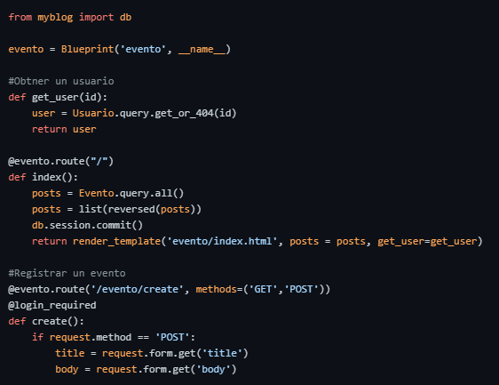
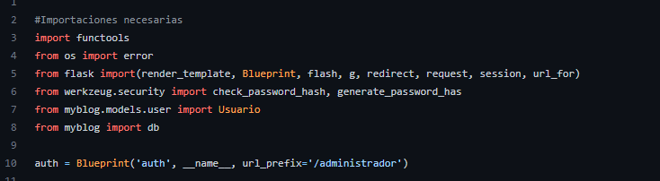
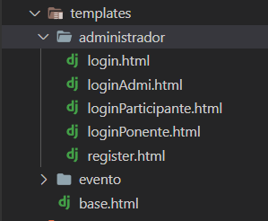
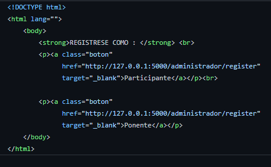
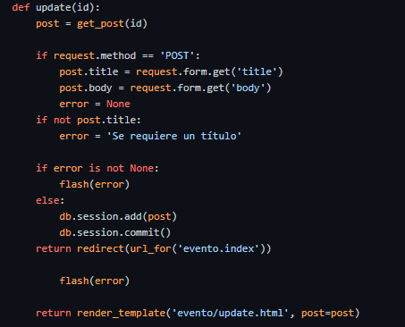

# Sistema de Publicación de Eventos 
# Relacionados con Ciecias de la Computación

## Propósito del proyecto

El propósito de este proyecto es realizar una página web que nos muestre los
eventos relacionados con "Ciencias de la computación" , en esta pagina web podremos publicar eventos 
, ver eventos e inscribirnos. Por otra párte con este proyecto se pretende aplicar los conocimientos aprendidos
durante el curso de Ingenieria de Software.

## Funcionalidades

## Prácticas de código legible aplicadas

### 1. Comentarios y documentación 

    Comentar el código es de mucha utilidad hoy en día porque permite entender mejor la funcionalidad del código para que
    demás desarrolladores puedan utilizarlo de diferentes maneras. 
    Un ejemplo en nuestro codigo es el siguiente:
    
  
    
### 2. Sangría consistente 

    Las sangrías ayudan a mantener un orden visual para mayo entendimiento.
    Un ejemplo en nuestro codigo es el siguiente:
    
  
    
 ### 3. Agrupación de códigos 

    En ocasiones un conjunto de tareas no ocupa mucha realización de código.
    Por lo que es recomendable mantenerlos en bloques para localizarlos mas rápido.
    Un ejemplo en nuestro codigo es el siguiente:
    
     
    

  ### 4. Esquema con nombres coherentes

    Los nombres deben tener límites de palabras para ello se usa el subquión o mayúsculas.
    Un ejemplo en nuestro codigo es el siguiente:
    
     
  
  
  ### 5. Límite de longitud de línea

    Los nombres deben tener límites de palabras para ello se usa el subquión o mayúsculas.
    Un ejemplo en nuestro codigo es el siguiente:
    
     
    
    
   ### 6. Evite el anidamiento profundo

    Demasiados niveles de anidamiento hacen que el código sea menos legible
    Un ejemplo en nuestro codigo es el siguiente:
    
   

## Estilos de programación aplicados

## Principios SOLID aplicados

## Conceptos DDD aplicados 
